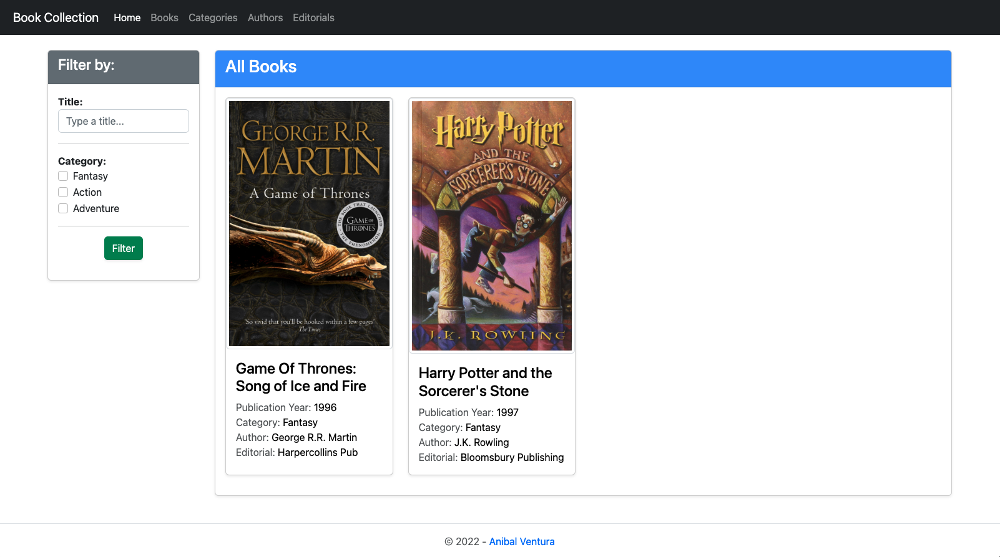
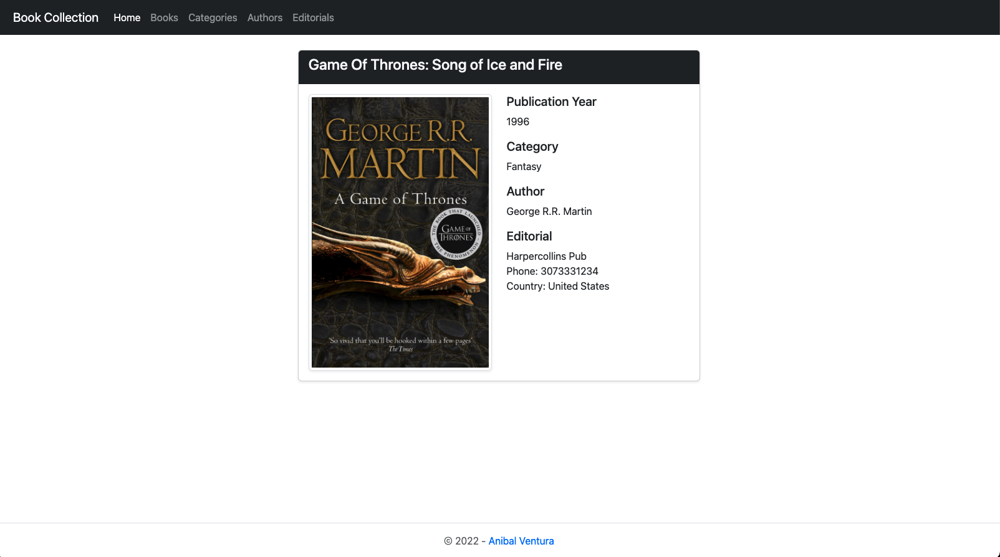
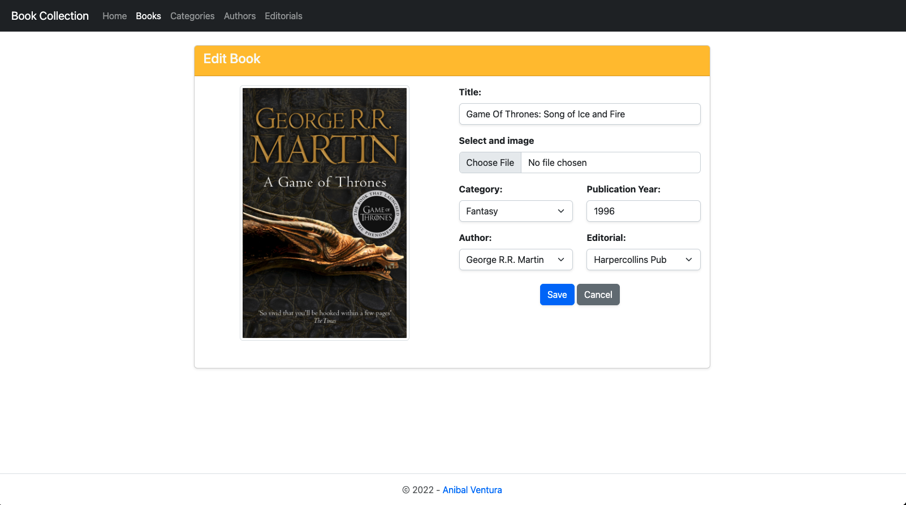
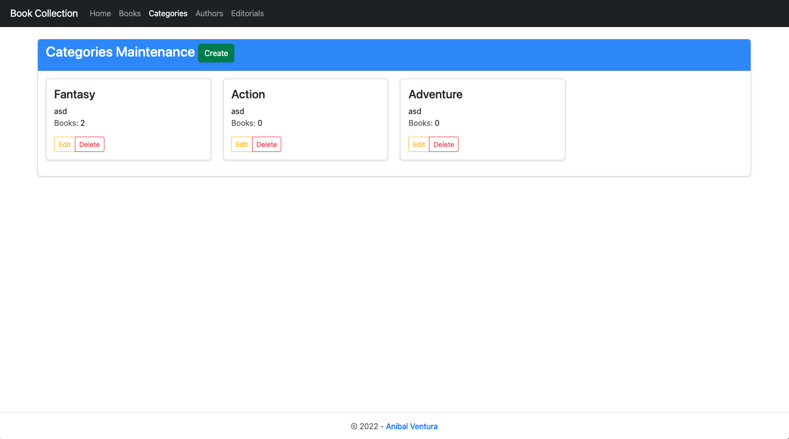

# Book Collection

[](https://nodejs.org/en/)
[](https://expressjs.com/)
[](https://handlebarsjs.com/)
[](https://sequelize.org/)
[](LICENSE.md)

<p align="center">
  
  
  
  
</p>

Book Collection with CRUD operations, persistence with Sequelize and MVC architecture.

## Features

- Home page to see all the Books created.
- Filter Books in home page by name and category.
- Data persistance with sequelize(mysql).
- Books, Categories, Authors and Editorials maintenance pages to perform CRUD operations.
- Select a book file picture and send email to author when create a book.
- Categories, Authors and Editorials associated book count.
- Form validation.

## Technologies

- HTML / Javascript / Bootstrap
- NodeJS / ExpressJS / Handlebars
- Sequelize / MySQL

## Dependencies

- [express ^4.17.1](https://www.npmjs.com/package/express)
- [express-handlebars ^5.3.2](https://www.npmjs.com/package/express-handlebars)
- [multer ^1.4.5-lts.1](https://www.npmjs.com/package/multer)
- [mysql2 ^2.3.3](https://www.npmjs.com/package/mysql2)
- [nodemailer ^6.7.7](https://www.npmjs.com/package/nodemailer)
- [sequelize ^6.21.3](https://www.npmjs.com/package/sequelize)
- [uuid ^8.3.2](https://www.npmjs.com/package/uuid)

### Dev Dependencies

- [nodemon ^2.0.12](https://www.npmjs.com/package/nodemon)

## Build

1. Download/clone project and run in terminal `npm install`
2. Run in terminal `npm start`

## License

```xml
MIT License

Copyright (c) 2022 Anibal Ventura
```
